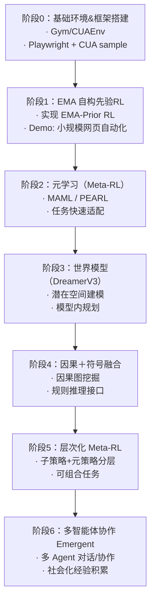

# 发展路线规划

下面给出一个面向"自生先验＋更高阶智能体"的半年—一年发展路线规划图示例，包含阶段目标、核心技术和输出物。

## 阶段解读

1. **阶段0：基础环境搭建（1–2 月）**  
   – 搭建 Gym/Playwright/CUAEnv，跑通小 demo；  
   – 熟悉 CUA、Stable-Baselines3、pytest、CI/CD。

2. **阶段1：EMA 自构先验 RL（2–4 月）**  
   – 如前示例实现 EMA-Prior RL 框架；  
   – 输出网页自动化小样本实验结果。

3. **阶段2：元学习（Meta-RL）（4–6 月）**  
   – 引入 MAML 或 PEARL 做多任务元训练；  
   – 验证新任务少样本快速收敛能力。

4. **阶段3：世界模型（DreamerV3）（6–9 月）**  
   – 复现 DreamerV3 流程，构建环境世界模型；  
   – 在潜在空间做 actor-critic 并规划。

5. **阶段4：因果＋符号融合（9–12 月）**  
   – 使用因果发现算法自动挖掘因果图；  
   – 封装可解释规则接口与神经表征结合。

6. **阶段5：层次化 Meta-RL（次年 Q1）**  
   – 抽象子任务、上层元控制；  
   – 实现"可组合策略库"及动态生成先验。

7. **阶段6：多智能体协作 Emergent（次年 Q2+）**  
   – 搭建多 Agent 交互环境（如沙盒网页）；  
   – 研究社会化经验和协同先验自生。

---

以上内容可作为项目中长期技术路线图，在不同阶段可同步评估效果并调整策略。 