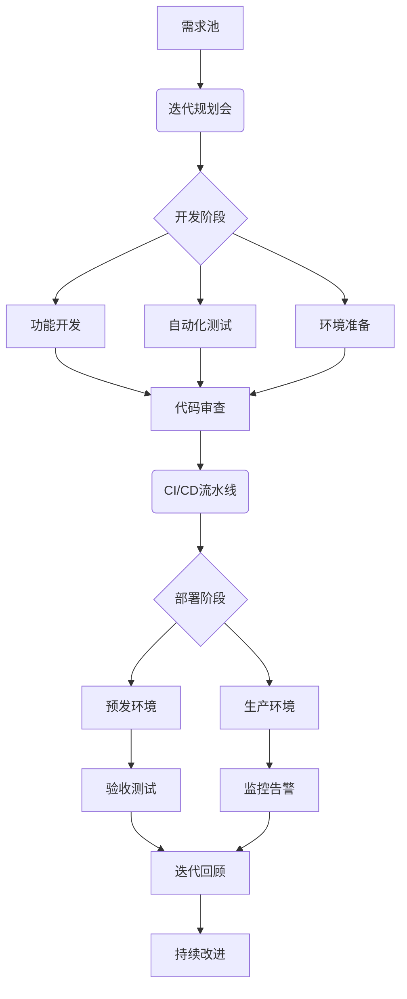

# DevOps全栈开发标准工作流（详细版）

## 1. 需求管理
### 1.1 需求收集

#### 1.1.1 与业务方进行需求访谈
- **准备阶段**
  - 确定访谈对象：产品经理、业务负责人、关键用户
  - 准备访谈提纲：明确访谈目标和关键问题
  - 安排访谈时间和地点：确保参与者都能参加

- **访谈过程**
  - 开场介绍：说明访谈目的和流程
  - 深入讨论：围绕业务需求、用户痛点、期望功能展开
  - 记录要点：使用录音或笔记记录关键信息
  - 确认理解：复述需求以确保理解正确

- **后续跟进**
  - 整理访谈记录：将访谈内容整理成文档
  - 发送确认邮件：请业务方确认访谈记录
  - 补充细节：根据反馈补充遗漏信息

#### 1.1.2 收集用户反馈和市场分析
- **用户反馈收集**
  - 用户调研：设计问卷或访谈提纲
  - 用户行为分析：通过数据分析工具（如Google Analytics）了解用户行为
  - 用户反馈渠道：收集来自客服、社交媒体、应用商店的反馈

- **市场分析**
  - 竞品分析：研究竞争对手的产品功能和市场表现
  - 行业趋势：了解行业最新动态和技术趋势
  - 用户需求变化：分析用户需求的变化趋势

#### 1.1.3 整理需求文档（PRD）
- **文档结构**
  - 项目概述：项目背景、目标和范围
  - 用户需求：用户画像、用户故事、使用场景
  - 功能需求：详细描述每个功能的需求
  - 非功能需求：性能、安全、可用性等要求
  - 验收标准：明确每个功能的验收条件

- **文档编写**
  - 使用清晰、简洁的语言
  - 配以图表和示例说明
  - 确保文档结构清晰、易于理解

- **文档评审**
  - 组织需求评审会议
  - 邀请业务方、开发团队、测试团队参与
  - 根据反馈修改和完善文档

### 1.2 需求分析

#### 1.2.1 使用用户故事地图梳理需求
- **准备工作**
  - 确定参与人员：产品经理、业务方、开发团队、测试团队
  - 准备工具：白板、便签、马克笔或使用数字工具（如Miro、Jira）
  - 收集需求文档：确保所有需求信息已准备齐全

- **创建用户故事地图**
  - 确定用户角色：识别系统的主要用户角色
  - 绘制用户旅程：按时间顺序列出用户的主要活动
  - 添加用户故事：在每个活动下添加具体的用户故事
  - 分组和排序：将相关用户故事分组，并按优先级排序

- **评审和调整**
  - 组织评审会议：邀请相关方评审用户故事地图
  - 调整和优化：根据反馈调整用户故事地图
  - 确认最终版本：确保所有相关方对用户故事地图达成一致

#### 1.2.2 识别核心功能和优先级
- **功能识别**
  - 列出所有功能：基于用户故事地图列出所有功能
  - 识别核心功能：确定对用户和业务最关键的功能
  - 功能分类：将功能分为核心功能、重要功能、次要功能

- **优先级评估**
  - 使用优先级评估方法：如MoSCoW法（Must have, Should have, Could have, Won't have）
  - 考虑业务价值：评估每个功能对业务的价值
  - 考虑技术复杂度：评估每个功能的技术实现难度
  - 确定优先级：根据业务价值和技术复杂度确定功能优先级

#### 1.2.3 定义验收标准
- **编写验收标准**
  - 明确功能目标：描述功能的预期结果
  - 定义成功条件：列出功能成功的具体条件
  - 使用具体指标：如响应时间、用户满意度等

- **评审验收标准**
  - 组织评审会议：邀请业务方、开发团队、测试团队参与
  - 确认验收标准：确保所有相关方对验收标准达成一致
  - 记录和存档：将验收标准记录在需求文档中

- **持续更新**
  - 根据需求变化更新验收标准
  - 确保验收标准始终与需求一致
  - 定期评审和优化验收标准

### 1.3 需求评审

#### 1.3.1 组织跨部门需求评审会议
- **会议准备**
  - 确定参会人员：产品经理、业务方、开发团队、测试团队、运维团队
  - 准备评审材料：需求文档、用户故事地图、验收标准
  - 安排会议时间和地点：确保所有关键人员都能参加
  - 发送会议邀请：提前发送会议议程和材料

- **会议流程**
  - 开场介绍：说明会议目的和流程
  - 需求讲解：由产品经理或业务方讲解需求
  - 讨论和反馈：各团队提出问题和建议
  - 记录要点：记录会议中的关键讨论和决策
  - 总结和确认：总结会议结果，确认下一步行动

#### 1.3.2 确认需求可行性和优先级
- **可行性评估**
  - 技术可行性：开发团队评估技术实现的可行性
  - 资源可行性：评估所需资源（人力、时间、预算）的可行性
  - 风险分析：识别潜在风险并制定应对措施

- **优先级确认**
  - 业务价值：业务方确认需求的业务价值
  - 技术复杂度：开发团队确认技术实现的复杂度
  - 优先级调整：根据业务价值和技术复杂度调整需求优先级
  - 确认最终优先级：所有相关方对需求优先级达成一致

#### 1.3.3 确定迭代计划
- **迭代规划**
  - 确定迭代周期：如两周一个迭代
  - 分配需求到迭代：根据优先级和可行性将需求分配到各个迭代
  - 制定迭代目标：明确每个迭代的目标和交付内容

- **资源分配**
  - 确定团队成员：分配开发、测试、运维等团队成员
  - 估算工作量：评估每个需求的工作量
  - 平衡资源：确保资源分配合理，避免过度负荷

- **计划确认**
  - 组织计划评审会议：邀请相关方评审迭代计划
  - 调整和优化：根据反馈调整迭代计划
  - 确认最终计划：所有相关方对迭代计划达成一致

- **计划跟踪**
  - 定期跟踪进度：通过每日站会、迭代回顾等方式跟踪进度
  - 调整计划：根据实际情况调整迭代计划
  - 确保交付：确保每个迭代按时交付

## 2. 架构设计
### 2.1 技术选型

#### 2.1.1 评估技术栈的适用性
- **需求分析**
  - 确定系统需求：如性能、安全性、可扩展性等
  - 识别技术需求：如编程语言、框架、数据库等
  - 考虑业务需求：如快速迭代、高可用性等

- **技术调研**
  - 收集候选技术：列出可能的技术栈
  - 技术对比：比较各技术的优缺点
  - 参考案例：研究类似项目的技术选型

- **适用性评估**
  - 功能匹配：评估技术是否满足系统需求
  - 团队熟悉度：评估团队对技术的熟悉程度
  - 社区支持：评估技术的社区活跃度和支持情况

#### 2.1.2 考虑性能、扩展性和维护成本
- **性能评估**
  - 基准测试：进行性能基准测试
  - 性能指标：如响应时间、吞吐量、并发能力
  - 性能优化：评估技术的性能优化能力

- **扩展性评估**
  - 水平扩展：评估技术的水平扩展能力
  - 垂直扩展：评估技术的垂直扩展能力
  - 扩展成本：评估扩展所需的资源和成本

- **维护成本评估**
  - 学习曲线：评估技术的学习曲线
  - 维护工具：评估可用的维护工具和资源
  - 长期支持：评估技术的长期支持和更新情况

#### 2.1.3 确定技术方案
- **方案制定**
  - 技术组合：确定技术栈的组合方案
  - 架构设计：初步设计系统架构
  - 技术文档：编写技术选型文档

- **方案评审**
  - 组织评审会议：邀请相关方评审技术方案
  - 讨论和反馈：各团队提出问题和建议
  - 调整和优化：根据反馈调整技术方案

- **方案确认**
  - 确认最终方案：所有相关方对技术方案达成一致
  - 记录和存档：将技术方案记录在项目文档中
  - 实施计划：制定技术方案的实施计划

- **持续评估**
  - 定期评估技术方案的有效性
  - 根据项目进展调整技术方案
  - 确保技术方案始终满足项目需求

### 2.2 系统设计

#### 2.2.1 绘制系统架构图
- **确定架构类型**
  - 单体架构：适用于小型项目
  - 微服务架构：适用于大型、复杂项目
  - 分层架构：如表现层、业务逻辑层、数据访问层

- **绘制架构图**
  - 确定组件：如前端、后端、数据库、缓存、消息队列等
  - 确定关系：描述组件之间的交互关系
  - 使用工具：如Visio、Lucidchart、Draw.io等

- **评审和优化**
  - 组织评审会议：邀请相关方评审架构图
  - 讨论和反馈：各团队提出问题和建议
  - 调整和优化：根据反馈调整架构图

#### 2.2.2 定义模块划分和接口规范
- **模块划分**
  - 功能模块：根据功能需求划分模块
  - 业务模块：根据业务领域划分模块
  - 技术模块：如日志模块、安全模块、配置模块等

- **接口规范**
  - 接口类型：如RESTful API、GraphQL、gRPC等
  - 接口设计：定义接口的URL、请求方法、参数、返回值
  - 接口文档：使用Swagger、Postman等工具生成接口文档

- **评审和确认**
  - 组织评审会议：邀请相关方评审模块划分和接口规范
  - 讨论和反馈：各团队提出问题和建议
  - 调整和优化：根据反馈调整模块划分和接口规范
  - 确认最终方案：所有相关方对模块划分和接口规范达成一致

#### 2.2.3 设计数据库模型
- **数据库选型**
  - 关系型数据库：如MySQL、PostgreSQL
  - 非关系型数据库：如MongoDB、Redis
  - 数据仓库：如Amazon Redshift、Google BigQuery

- **数据库设计**
  - 表结构设计：定义表、字段、主键、外键等
  - 索引设计：设计合适的索引以提高查询性能
  - 数据关系：定义表之间的关系，如一对一、一对多、多对多

- **评审和优化**
  - 组织评审会议：邀请相关方评审数据库模型
  - 讨论和反馈：各团队提出问题和建议
  - 调整和优化：根据反馈调整数据库模型
  - 确认最终方案：所有相关方对数据库模型达成一致

- **持续维护**
  - 定期评估数据库模型的有效性
  - 根据项目进展调整数据库模型
  - 确保数据库模型始终满足项目需求

### 2.3 设计评审

#### 2.3.1 组织技术评审会议
- **会议准备**
  - 确定参会人员：架构师、开发团队、测试团队、运维团队、业务方
  - 准备评审材料：系统架构图、模块划分、接口规范、数据库模型
  - 安排会议时间和地点：确保所有关键人员都能参加
  - 发送会议邀请：提前发送会议议程和材料

- **会议流程**
  - 开场介绍：说明会议目的和流程
  - 设计讲解：由架构师或设计负责人讲解设计方案
  - 讨论和反馈：各团队提出问题和建议
  - 记录要点：记录会议中的关键讨论和决策
  - 总结和确认：总结会议结果，确认下一步行动

#### 2.3.2 评估设计方案的可行性
- **技术可行性**
  - 技术实现：评估技术实现的可行性
  - 技术风险：识别潜在技术风险并制定应对措施
  - 技术资源：评估所需技术资源的可用性

- **业务可行性**
  - 业务需求：评估设计方案是否满足业务需求
  - 业务价值：评估设计方案对业务的价值
  - 业务风险：识别潜在业务风险并制定应对措施

- **资源可行性**
  - 人力资源：评估所需人力资源的可用性
  - 时间资源：评估项目时间表的可行性
  - 预算资源：评估项目预算的可行性

#### 2.3.3 确定技术债务管理策略
- **技术债务识别**
  - 代码质量：识别代码质量方面的技术债务
  - 架构设计：识别架构设计方面的技术债务
  - 技术栈：识别技术栈方面的技术债务

- **技术债务评估**
  - 债务影响：评估技术债务对项目的影响
  - 债务成本：评估偿还技术债务的成本
  - 债务优先级：确定技术债务的优先级

- **技术债务管理**
  - 偿还计划：制定技术债务的偿还计划
  - 预防措施：制定预防新债务产生的措施
  - 定期评估：定期评估技术债务的状态和影响

- **持续改进**
  - 定期评审：定期评审技术债务管理策略
  - 优化策略：根据项目进展优化技术债务管理策略
  - 确保可持续性：确保技术债务管理策略的可持续性

## 3. 开发实施
### 3.1 环境准备

#### 3.1.1 搭建开发环境
- **操作系统**
  - 确定操作系统：如Windows、Linux、macOS
  - 安装必要工具：如终端、编辑器、浏览器等

- **开发工具**
  - 安装IDE：如VSCode、PyCharm、IntelliJ IDEA
  - 安装编译器/解释器：如Python、Java、Node.js
  - 安装构建工具：如Maven、Gradle、Webpack

- **依赖管理**
  - 安装包管理工具：如pip、npm、yarn
  - 配置依赖文件：如requirements.txt、package.json
  - 安装项目依赖：使用包管理工具安装依赖

- **环境配置**
  - 配置环境变量：如PATH、JAVA_HOME、PYTHONPATH
  - 配置开发工具：如IDE设置、代码格式化工具
  - 配置本地服务：如数据库、缓存、消息队列

#### 3.1.2 配置版本控制系统
- **选择版本控制系统**
  - 确定版本控制系统：如Git、SVN
  - 安装版本控制工具：如Git、GitHub Desktop

- **初始化版本库**
  - 创建版本库：使用`git init`或`svnadmin create`
  - 配置忽略文件：如.gitignore、.svnignore
  - 添加初始文件：如README、LICENSE、.gitattributes

- **配置远程仓库**
  - 创建远程仓库：如GitHub、GitLab、Bitbucket
  - 添加远程仓库：使用`git remote add`
  - 配置访问权限：如SSH密钥、访问令牌

- **分支管理**
  - 创建主分支：如main、master
  - 创建开发分支：如develop
  - 配置分支策略：如Git Flow、GitHub Flow

#### 3.1.3 初始化项目结构
- **项目目录结构**
  - 创建项目目录：如src、tests、docs
  - 配置项目文件：如README、LICENSE、.gitignore
  - 创建配置文件：如config.json、.env

- **代码结构**
  - 创建模块目录：如controllers、models、services
  - 创建入口文件：如main.py、index.js
  - 创建测试目录：如unit_tests、integration_tests

- **文档结构**
  - 创建文档目录：如docs、wiki
  - 编写项目文档：如README、API文档、开发指南
  - 配置文档工具：如Sphinx、JSDoc、Swagger

- **评审和确认**
  - 组织评审会议：邀请相关方评审项目结构
  - 讨论和反馈：各团队提出问题和建议
  - 调整和优化：根据反馈调整项目结构
  - 确认最终方案：所有相关方对项目结构达成一致

### 3.2 编码实现

#### 3.2.1 遵循编码规范（PEP8等）
- **编码规范选择**
  - 确定编码规范：如PEP8（Python）、Google Java Style（Java）、Airbnb JavaScript Style（JavaScript）
  - 配置代码格式化工具：如Black（Python）、Prettier（JavaScript）、Checkstyle（Java）

- **代码格式化**
  - 自动格式化代码：使用代码格式化工具
  - 配置IDE：设置IDE自动应用编码规范
  - 代码风格检查：使用Lint工具（如pylint、eslint）检查代码风格

- **代码审查**
  - 提交代码前自查：确保代码符合编码规范
  - 代码审查时检查：审查代码时关注编码规范
  - 持续改进：根据审查反馈优化代码风格

#### 3.2.2 实施测试驱动开发（TDD）
- **TDD流程**
  - 编写测试用例：先编写单元测试用例
  - 运行测试用例：确保测试用例失败
  - 编写实现代码：编写代码使测试用例通过
  - 重构代码：优化代码结构和性能

- **测试用例设计**
  - 确定测试场景：覆盖正常、边界、异常情况
  - 编写测试代码：使用测试框架（如unittest、JUnit、Jest）
  - 测试数据准备：准备测试数据和模拟对象

- **持续集成**
  - 自动化测试：配置CI/CD管道自动运行测试
  - 快速反馈：确保测试结果快速反馈给开发人员
  - 测试覆盖率：监控测试覆盖率，确保覆盖关键代码

#### 3.2.3 编写单元测试
- **单元测试范围**
  - 测试单个函数/方法：确保每个函数/方法的行为正确
  - 测试单个类：确保类的行为和状态正确
  - 测试单个模块：确保模块的功能正确

- **单元测试编写**
  - 使用测试框架：如unittest（Python）、JUnit（Java）、Jest（JavaScript）
  - 编写测试用例：覆盖正常、边界、异常情况
  - 使用断言：验证代码的输出是否符合预期

- **单元测试执行**
  - 本地执行：在开发环境中执行单元测试
  - 自动化执行：配置CI/CD管道自动执行单元测试
  - 测试报告：生成测试报告，分析测试结果

- **单元测试维护**
  - 持续更新：根据代码变更更新单元测试
  - 测试覆盖率：监控测试覆盖率，确保覆盖关键代码
  - 测试优化：优化测试用例，提高测试效率

### 3.3 代码审查

#### 3.3.1 提交Pull Request
- **准备工作**
  - 完成开发任务：确保代码功能实现完整
  - 自测代码：运行单元测试和集成测试，确保通过
  - 代码格式化：使用代码格式化工具（如Black、Prettier）格式化代码

- **创建Pull Request**
  - 选择目标分支：如main、develop
  - 填写PR描述：详细描述代码变更内容和目的
  - 关联任务：关联相关任务或问题（如Jira issue、GitHub issue）
  - 添加标签：如bugfix、feature、refactor

- **通知相关人员**
  - 指定审查人员：选择相关开发人员或团队进行审查
  - 发送通知：通过邮件或即时通讯工具通知审查人员

#### 3.3.2 进行代码审查（Code Review）
- **审查内容**
  - 代码功能：确保代码功能符合需求
  - 代码质量：检查代码风格、命名规范、注释等
  - 代码结构：评估代码的可读性、可维护性和扩展性
  - 测试覆盖：检查单元测试和集成测试的覆盖率

- **审查工具**
  - 使用代码审查工具：如GitHub、GitLab、Bitbucket
  - 添加评论：在代码行上添加具体评论
  - 提出建议：提供改进建议或替代方案

- **审查流程**
  - 初步审查：快速浏览代码，了解整体变更
  - 详细审查：逐行审查代码，关注细节
  - 讨论和反馈：与开发人员讨论审查发现的问题
  - 记录审查结果：记录审查发现的问题和建议

#### 3.3.3 修复审查发现的问题
- **问题分类**
  - 严重问题：如功能错误、安全漏洞
  - 一般问题：如代码风格、命名规范
  - 建议问题：如代码优化、性能提升

- **问题修复**
  - 修复代码：根据审查反馈修改代码
  - 重新测试：运行单元测试和集成测试，确保通过
  - 更新PR：提交修复后的代码，更新PR描述

- **再次审查**
  - 通知审查人员：通知审查人员问题已修复
  - 再次审查：审查人员确认问题已修复
  - 合并代码：审查通过后，合并代码到目标分支

- **持续改进**
  - 总结审查经验：记录审查中的常见问题和改进建议
  - 优化审查流程：根据项目进展优化代码审查流程
  - 提高审查效率：通过培训和工具提高审查效率

## 4. 测试验证
### 4.1 单元测试

#### 4.1.1 编写单元测试用例
- **测试用例设计**
  - 确定测试场景：覆盖正常、边界、异常情况
  - 编写测试代码：使用测试框架（如unittest、JUnit、Jest）
  - 测试数据准备：准备测试数据和模拟对象

- **测试用例编写**
  - 测试函数/方法：确保每个函数/方法的行为正确
  - 测试类：确保类的行为和状态正确
  - 测试模块：确保模块的功能正确

- **测试用例结构**
  - 测试类：组织相关测试用例
  - 测试方法：每个测试方法测试一个特定功能
  - 断言：验证代码的输出是否符合预期

- **测试用例评审**
  - 组织评审会议：邀请相关方评审测试用例
  - 讨论和反馈：各团队提出问题和建议
  - 调整和优化：根据反馈调整测试用例

#### 4.1.2 执行单元测试
- **本地执行**
  - 运行单个测试：使用IDE或命令行运行单个测试
  - 运行所有测试：使用测试框架运行所有测试
  - 查看测试结果：分析测试输出，查看通过/失败情况

- **自动化执行**
  - 配置CI/CD管道：自动运行单元测试
  - 快速反馈：确保测试结果快速反馈给开发人员
  - 测试报告：生成测试报告，分析测试结果

- **测试覆盖率**
  - 监控测试覆盖率：使用工具（如coverage.py、JaCoCo）监控测试覆盖率
  - 提高覆盖率：编写更多测试用例，提高覆盖率
  - 确保关键代码覆盖：确保关键代码被测试覆盖

#### 4.1.3 修复发现的缺陷
- **缺陷分类**
  - 严重缺陷：如功能错误、安全漏洞
  - 一般缺陷：如性能问题、边界条件错误
  - 建议问题：如代码优化、可读性提升

- **缺陷修复**
  - 定位问题：通过测试输出和日志定位问题
  - 修复代码：根据问题原因修改代码
  - 重新测试：运行单元测试，确保问题已修复

- **缺陷验证**
  - 通知测试人员：通知测试人员问题已修复
  - 再次测试：测试人员确认问题已修复
  - 更新测试用例：根据修复情况更新测试用例

- **持续改进**
  - 总结缺陷经验：记录常见缺陷和修复方法
  - 优化测试流程：根据项目进展优化单元测试流程
  - 提高测试效率：通过培训和工具提高测试效率

### 4.2 集成测试

#### 4.2.1 编写集成测试用例
- **测试用例设计**
  - 确定测试场景：覆盖模块间的正常、边界、异常交互
  - 编写测试代码：使用测试框架（如unittest、JUnit、Jest）
  - 测试数据准备：准备测试数据和模拟对象

- **测试用例编写**
  - 测试模块间交互：确保模块间的接口和数据传递正确
  - 测试系统功能：确保系统整体功能符合需求
  - 测试外部依赖：如数据库、API、第三方服务

- **测试用例结构**
  - 测试类：组织相关测试用例
  - 测试方法：每个测试方法测试一个特定交互
  - 断言：验证模块间的输出是否符合预期

- **测试用例评审**
  - 组织评审会议：邀请相关方评审测试用例
  - 讨论和反馈：各团队提出问题和建议
  - 调整和优化：根据反馈调整测试用例

#### 4.2.2 执行集成测试
- **本地执行**
  - 运行单个测试：使用IDE或命令行运行单个测试
  - 运行所有测试：使用测试框架运行所有测试
  - 查看测试结果：分析测试输出，查看通过/失败情况

- **自动化执行**
  - 配置CI/CD管道：自动运行集成测试
  - 快速反馈：确保测试结果快速反馈给开发人员
  - 测试报告：生成测试报告，分析测试结果

- **测试覆盖率**
  - 监控测试覆盖率：使用工具（如coverage.py、JaCoCo）监控测试覆盖率
  - 提高覆盖率：编写更多测试用例，提高覆盖率
  - 确保关键交互覆盖：确保关键模块间的交互被测试覆盖

#### 4.2.3 验证模块间交互
- **交互验证**
  - 数据传递：验证模块间的数据传递是否正确
  - 接口调用：验证模块间的接口调用是否符合预期
  - 状态同步：验证模块间的状态同步是否正确

- **问题定位**
  - 通过测试输出和日志定位问题
  - 分析模块间的交互流程，找出问题原因
  - 与相关开发人员讨论，确定解决方案

- **问题修复**
  - 修复代码：根据问题原因修改代码
  - 重新测试：运行集成测试，确保问题已修复
  - 更新测试用例：根据修复情况更新测试用例

- **持续改进**
  - 总结交互问题：记录常见交互问题和修复方法
  - 优化测试流程：根据项目进展优化集成测试流程
  - 提高测试效率：通过培训和工具提高测试效率

### 4.3 端到端测试

#### 4.3.1 编写端到端测试用例
- **测试用例设计**
  - 确定测试场景：覆盖完整的业务流程，包括正常、边界、异常情况
  - 编写测试代码：使用端到端测试框架（如Selenium、Cypress、Playwright）
  - 测试数据准备：准备测试数据和模拟对象

- **测试用例编写**
  - 测试用户流程：如注册、登录、下单、支付等
  - 测试系统交互：如前端与后端的交互、系统与外部服务的交互
  - 测试用户体验：如页面加载速度、响应时间、错误提示

- **测试用例结构**
  - 测试类：组织相关测试用例
  - 测试方法：每个测试方法测试一个完整业务流程
  - 断言：验证业务流程的输出是否符合预期

- **测试用例评审**
  - 组织评审会议：邀请相关方评审测试用例
  - 讨论和反馈：各团队提出问题和建议
  - 调整和优化：根据反馈调整测试用例

#### 4.3.2 执行端到端测试
- **本地执行**
  - 运行单个测试：使用IDE或命令行运行单个测试
  - 运行所有测试：使用测试框架运行所有测试
  - 查看测试结果：分析测试输出，查看通过/失败情况

- **自动化执行**
  - 配置CI/CD管道：自动运行端到端测试
  - 快速反馈：确保测试结果快速反馈给开发人员
  - 测试报告：生成测试报告，分析测试结果

- **测试覆盖率**
  - 监控测试覆盖率：使用工具（如coverage.py、JaCoCo）监控测试覆盖率
  - 提高覆盖率：编写更多测试用例，提高覆盖率
  - 确保关键流程覆盖：确保关键业务流程被测试覆盖

#### 4.3.3 验证完整业务流程
- **流程验证**
  - 数据流验证：验证数据在整个流程中的传递和处理是否正确
  - 状态验证：验证系统状态在整个流程中的变化是否正确
  - 用户体验验证：验证用户在整个流程中的体验是否符合预期

- **问题定位**
  - 通过测试输出和日志定位问题
  - 分析业务流程，找出问题原因
  - 与相关开发人员讨论，确定解决方案

- **问题修复**
  - 修复代码：根据问题原因修改代码
  - 重新测试：运行端到端测试，确保问题已修复
  - 更新测试用例：根据修复情况更新测试用例

- **持续改进**
  - 总结流程问题：记录常见流程问题和修复方法
  - 优化测试流程：根据项目进展优化端到端测试流程
  - 提高测试效率：通过培训和工具提高测试效率

## 5. 持续集成

### 5.1 构建自动化
- **配置CI/CD管道**
  - 选择CI/CD工具：如Jenkins、GitLab CI、GitHub Actions
  - 配置构建脚本：如Makefile、build.gradle、package.json
  - 配置测试脚本：如unittest、JUnit、Jest
  - 配置部署脚本：如Docker、Kubernetes、Ansible

- **自动化构建和测试**
  - 构建流程：编译代码、打包应用、生成镜像
  - 测试流程：运行单元测试、集成测试、端到端测试
  - 构建结果：生成构建报告、测试报告、代码覆盖率报告

- **设置代码质量门禁**
  - 代码风格检查：使用Lint工具（如pylint、eslint）检查代码风格
  - 代码复杂度检查：使用工具（如SonarQube）检查代码复杂度
  - 测试覆盖率检查：设置最低测试覆盖率要求
  - 构建结果检查：确保构建和测试通过后才能合并代码

### 5.2 持续集成
- **提交代码触发构建**
  - 提交代码：开发人员提交代码到版本控制系统
  - 触发构建：CI/CD工具自动检测代码变更并触发构建
  - 构建日志：记录构建过程中的详细日志

- **快速反馈构建结果**
  - 构建状态：实时显示构建状态（成功、失败、进行中）
  - 构建通知：通过邮件、即时通讯工具通知构建结果
  - 构建报告：生成详细的构建报告，包括测试结果、代码覆盖率等

- **修复构建失败问题**
  - 问题定位：通过构建日志和测试输出定位问题
  - 问题修复：开发人员根据问题原因修改代码
  - 重新构建：提交修复后的代码，重新触发构建
  - 问题跟踪：记录构建失败问题和修复过程

### 5.3 持续交付
- **自动化部署到测试环境**
  - 部署流程：自动部署应用到测试环境
  - 环境配置：确保测试环境的配置与生产环境一致
  - 部署验证：验证应用在测试环境中的运行状态

- **进行验收测试**
  - 测试流程：运行验收测试，验证应用功能
  - 测试报告：生成验收测试报告，分析测试结果
  - 问题反馈：将测试发现的问题反馈给开发人员

- **准备生产发布**
  - 发布计划：制定生产发布计划，确定发布时间和步骤
  - 发布验证：验证应用在生产环境中的运行状态
  - 回滚计划：制定回滚计划，确保发布失败时能快速回滚
  - 发布通知：通知相关方发布结果，记录发布日志

## 6. 部署运维
### 6.1 生产部署
- **执行蓝绿部署或金丝雀发布**
  - 蓝绿部署：准备两个独立的环境（蓝环境和绿环境），在新环境（绿环境）部署新版本，验证通过后切换流量
  - 金丝雀发布：逐步将新版本部署到部分生产环境，验证通过后逐步扩大范围
  - 部署工具：使用工具（如Kubernetes、AWS CodeDeploy）自动化部署流程

- **监控部署过程**
  - 部署状态：实时监控部署状态（成功、失败、进行中）
  - 系统健康：监控系统健康指标（如CPU、内存、磁盘）
  - 日志记录：记录部署过程中的详细日志

- **验证生产环境功能**
  - 功能验证：验证应用在生产环境中的功能是否正常
  - 性能验证：验证应用在生产环境中的性能是否符合预期
  - 用户验证：通过用户反馈验证应用的使用情况

### 6.2 系统监控
- **配置实时监控系统**
  - 监控工具：选择监控工具（如Prometheus、Grafana、New Relic）
  - 监控指标：配置监控指标（如CPU、内存、磁盘、网络）
  - 监控面板：创建监控面板，实时显示系统状态

- **设置告警阈值**
  - 告警规则：设置告警规则（如CPU使用率超过80%）
  - 告警通知：配置告警通知（如邮件、短信、即时通讯工具）
  - 告警处理：记录告警处理过程和结果

- **收集和分析日志**
  - 日志收集：使用工具（如ELK Stack、Fluentd）收集日志
  - 日志存储：配置日志存储（如Elasticsearch、S3）
  - 日志分析：分析日志，识别潜在问题和优化点

### 6.3 故障处理
- **快速响应告警**
  - 告警接收：实时接收告警通知
  - 告警确认：确认告警的真实性和严重性
  - 告警处理：根据告警类型和严重性采取相应措施

- **定位和修复问题**
  - 问题定位：通过日志、监控数据和系统状态定位问题
  - 问题修复：根据问题原因修复代码或配置
  - 问题验证：验证问题是否已修复，系统是否恢复正常

- **执行回滚操作（必要时）**
  - 回滚计划：制定回滚计划，确保回滚过程可控
  - 回滚执行：执行回滚操作，恢复到稳定版本
  - 回滚验证：验证回滚后的系统状态和功能
  - 回滚记录：记录回滚过程和结果，分析回滚原因

## 7. 持续改进

### 7.1 回顾会议
- **定期组织Sprint回顾**
  - 会议频率：每个Sprint结束后组织回顾会议
  - 参会人员：开发团队、产品经理、业务方
  - 会议议程：回顾Sprint目标、成果、问题和改进点

- **识别改进机会**
  - 问题识别：识别Sprint中的问题和瓶颈
  - 成功总结：总结Sprint中的成功经验和最佳实践
  - 改进建议：提出改进建议和优化方案

- **制定改进计划**
  - 优先级评估：评估改进建议的优先级
  - 行动计划：制定具体的改进行动计划
  - 责任分配：分配改进行动的责任人和时间表
  - 跟踪执行：跟踪改进行动的执行情况和效果

### 7.2 技术债务管理
- **定期评估技术债务**
  - 债务识别：识别代码质量、架构设计、技术栈等方面的技术债务
  - 债务评估：评估技术债务的影响和成本
  - 债务优先级：确定技术债务的优先级

- **制定偿还计划**
  - 偿还策略：制定技术债务的偿还策略（如逐步偿还、集中偿还）
  - 偿还计划：制定具体的偿还计划和时间表
  - 资源分配：分配偿还技术债务所需的资源

- **预防新债务产生**
  - 代码审查：通过代码审查预防新债务产生
  - 技术规范：制定和遵循技术规范，减少技术债务
  - 持续改进：通过持续改进流程优化技术债务管理

### 7.3 知识分享
- **组织技术分享会**
  - 分享主题：确定技术分享的主题（如新技术、最佳实践、问题解决）
  - 分享形式：采用多种形式（如讲座、工作坊、代码评审）
  - 分享记录：记录技术分享的内容和反馈

- **编写技术文档**
  - 文档类型：编写各种技术文档（如设计文档、API文档、操作手册）
  - 文档维护：定期更新和维护技术文档
  - 文档评审：组织技术文档的评审和优化

- **建立知识库**
  - 知识库平台：选择知识库平台（如Confluence、Wiki、GitHub Wiki）
  - 知识库内容：整理和归档技术文档、分享记录、最佳实践
  - 知识库维护：定期更新和维护知识库内容

## 8. 绩效评估

### 8.1 交付速度
- **跟踪迭代交付速度**
  - 交付指标：跟踪每个迭代的交付速度（如完成的故事点、功能数）
  - 交付报告：生成交付速度报告，分析交付趋势
  - 交付目标：设定和调整交付目标，确保交付速度符合预期

- **分析瓶颈环节**
  - 瓶颈识别：识别交付流程中的瓶颈环节（如需求分析、开发、测试）
  - 瓶颈分析：分析瓶颈环节的原因和影响
  - 瓶颈解决：制定和实施瓶颈解决方案

- **优化交付流程**
  - 流程优化：优化交付流程，提高交付效率
  - 工具优化：优化交付工具，提高交付自动化程度
  - 团队优化：优化团队协作，提高交付协同效率

### 8.2 系统稳定性
- **监控系统可用性**
  - 可用性指标：监控系统的可用性指标（如uptime、MTTR、MTBF）
  - 可用性报告：生成系统可用性报告，分析可用性趋势
  - 可用性目标：设定和调整系统可用性目标，确保系统稳定性

- **分析故障原因**
  - 故障记录：记录系统故障的详细信息和处理过程
  - 故障分析：分析故障原因和影响，识别根本原因
  - 故障预防：制定和实施故障预防措施

- **提升系统稳定性**
  - 系统优化：优化系统架构和代码，提高系统稳定性
  - 监控优化：优化系统监控和告警，提高故障响应速度
  - 运维优化：优化系统运维流程，提高系统维护效率

### 8.3 用户满意度
- 收集用户反馈
- 分析用户满意度
- 改进用户体验

### 8.4 创新能力
- 跟踪技术趋势
- 评估新技术应用
- 推动技术创新

# 五人DevOps团队协作方案

## 角色分工
| 角色              | 职责范围                                                                 | 工作量占比 |
|-------------------|------------------------------------------------------------------------|------------|
| **团队负责人**     | 需求管理、迭代规划、技术决策、风险管理、跨团队协调                             | 20%技术+80%管理 |
| **全栈开发(2人)**  | 前后端开发、自动化测试、CI/CD维护、技术文档编写                              | 70%开发+30%运维 |
| **后端/DevOps**    | 后端开发、云架构设计、部署运维、监控系统维护、安全防护                         | 50%开发+50%运维 |
| **测试/质量保障**  | 测试用例设计、自动化测试开发、质量门禁配置、用户体验优化                       | 40%测试+30%文档+30%需求 |

## 协作工作流设计


## 每日工作节奏
**上午 9:00-9:15 站会**
- 每人同步：昨日进展/今日计划/阻塞问题
- 负责人记录问题并分配

**开发时段 9:30-12:00**
- 全栈开发：功能实现+单元测试
- 后端/DevOps：架构优化+部署脚本
- 测试：编写自动化测试用例

**下午 1:30-3:00 深度工作**
- 集中处理复杂技术问题
- 进行代码审查和设计讨论

**协作时段 3:30-5:00**
- 结对编程解决复杂问题
- 配置流水线和验证部署
- 编写技术文档和测试报告

**5:00-5:30 当日总结**
- 提交代码并触发构建
- 验证自动化测试结果
- 更新任务看板状态

## 关键协作机制
1. **需求双人负责制**
   - 每个需求分配主开发+备份开发
   - 需求文档必须包含测试验收标准

2. **自动化质量门禁**
   ```bash
   # 代码提交时自动执行
   git push → 代码扫描 → 单元测试 → 构建镜像 → 部署测试环境 → 自动化验收测试
   ```

3. **值班轮换制度**
   - 每日指定1人负责监控告警响应
   - 复杂问题升级为团队协作处理
   - 值班记录纳入知识库

4. **文档即代码**
   ```project
   docs/
     ├── architecture/  # 架构设计
     ├── runbook/       # 运维手册
     ├── decisions/     # 技术决策记录
     └── onboarding/    # 新人指南
   ```

## 工具链配置
| 领域         | 工具选择                          | 负责人       |
|--------------|---------------------------------|-------------|
| 代码托管      | GitHub                         | 全栈开发     |
| CI/CD        | GitHub Actions                 | 后端/DevOps |
| 监控告警      | Prometheus + Grafana           | 后端/DevOps |
| 文档协作      | Notion + Markdown              | 测试/质量   |
| 任务管理      | Jira + Confluence              | 团队负责人   |
| 云基础设施    | AWS + Terraform                | 后端/DevOps |
| 通信协作      | Slack + Zoom                   | 全员        |

## 关键指标
1. **交付效率**
   - 需求交付周期 < 3天
   - CI流水线执行时间 < 15分钟
   - 部署频率 ≥ 3次/天

2. **质量保障**
   - 单元测试覆盖率 ≥ 80%
   - 自动化测试通过率 100%
   - 生产事故恢复时间 < 30分钟

3. **团队健康**
   - 技术债务增长率 < 5%/月
   - 知识文档更新频率 ≥ 2篇/周
   - 跨角色协作时间占比 ≈ 30%